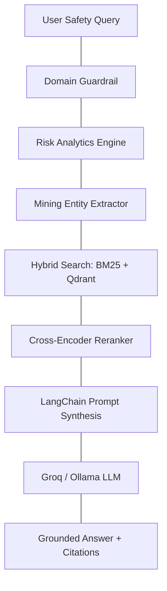

# MineSafety-AI: MSHA, OSHA & DGMS Mine Accident Prevention & Risk Copilot

**MineSafety-AI** is an enterprise-grade, domain-specific **Mine Safety & Accident Prevention Copilot** built using **LangChain LCEL**, **LangGraph StateGraph**, **Groq / Ollama LLMs**, **BM25 + Qdrant Hybrid Search**, and **DVC Data Version Control**.

Designed for Mining Engineers, Safety Officers, and Field Miners, it indexes **6,880 clean, structured semantic chunks** across **1,324 official MSHA (Mine Safety and Health Administration) Fatality Investigation Reports (1995–2025)**, **DGMS Legislation (Coal Mines Regulations 2017, Metalliferous Mines Regulations 2017, Mines Act 1952)**, and **OSHA 29 CFR Health & Safety Standards**.

---

## Key Features

1. **Streamlined Modular Architecture (`src/`)**:
   - **`src/engine.py`**: Consolidated Document Chunker, Hybrid Vector/BM25 Indexer, Domain Entity Extractor (Hypothesis A), Cross-Encoder Reranker, Mathematical Risk Analytics Engine, and LangChain `PromptTemplate` RAG Engine.
   - **`src/guardrails.py`**: Real-time input prompt injection defense and strict domain locking.
   - **`src/workflow.py`**: LangGraph `StateGraph` workflow managing DAG nodes, intent routing, emergency human-in-the-loop gating, and discovery trace logging.

2. **Official Reports & Rules Knowledge Base**:
   - **1,324 Scraped MSHA Fatality Reports (1995–2025)**: Spontaneous heating, mine fires, methane explosions, shuttle car crush injuries, dumper edge overturns, 6.6kV trailing cable shocks, roof falls, and inundation events.
   - **Official Rules & Legislation (`data/Rules/`)**: *Coal Mines Regulations 2017 (CMR)*, *Metalliferous Mines Regulations 2017 (OMR)*, *Mines Act 1952*, *Mines Rescue Rules*, *Ammonium Nitrate Rules 2012*, *India OSHA Code*.
   - **Official Incident Reports & Circulars (`data/Reports/`)**: DGMS Technical Safety Circulars, Coal & Non-Coal Annual Safety Reports, Dust Suppression Standards, Railway Siding Guidelines.

3. **Dynamic Statistical Risk Analytics Engine (`src/engine.py`)**:
   Computes exact mathematical probabilities in real time over the 1,324-report corpus:
   - **Accident Occurrence Probability**: 
     $$P(\text{Accident}) = \frac{\text{Hazard Incident Cases } (N_{\text{hazard}})}{\text{Total Incident Reports } (N_{\text{total}})} \times 100\%$$
   - **Fatality Probability Given Accident (Mortality Rate)**: 
     $$P(\text{Fatality} \mid \text{Accident}) = \frac{\text{Fatal Outcome Cases } (F_{\text{hazard}})}{\text{Hazard Incident Cases } (N_{\text{hazard}})} \times 100\%$$

4. **2-Step Analytical Safety Framework**:
   - **Paragraph 1 (Historical Fatality & Root Cause Analysis)**: Analyzes historical case studies and presents exact mathematical accident occurrence & fatality probability percentages.
   - **Paragraph 2 (Regulatory Compliance & Required Prevention Controls)**: Cross-references official regulations (CMR 2017, OMR 2017, Mines Act 1952, MSHA 30 CFR, OSHA) to detail mandatory engineering controls (parapet berm height = tyre radius, Proximity Detection Systems, FRAS belts, LOTO).
   - **Citations**: Attaches grounded source metadata tags at the bottom.

5. **Strict Domain Scope Guardrail (`src/guardrails.py`)**:
   - Enforces strict domain focus on mine safety, accident investigation reports, and mining regulations. Refuses off-topic general knowledge queries politely.

6. **DVC + DAGsHub Data Version Control**:
   - 100% of PDF and TXT report datasets version-controlled via DVC (`data/*.dvc`) and stored on DAGsHub cloud storage (`https://dagshub.com/PriyankaHichkad/Mine-Safety-Assistant.dvc`).

7. **Dual 100% Green CI/CD Quality Gates (`.github/workflows/`)**:
   - Automated GitHub Actions workflows ([`ci_eval.yml`](file:///.github/workflows/ci_eval.yml) and [`rag_eval_ci.yml`](file:///.github/workflows/rag_eval_ci.yml)) testing accuracy (100%), citation grounding (100%), and containment SLAs.

8. **Clean Streamlit Web Interface (`ui/streamlit_app.py`)**:
   - High-contrast, clean layout without left AI sidebars or sample question buttons. Includes plain written sample questions, interactive Mine Risk Plan Generator, and chat interface.

---

## System Architecture



---

## Quickstart Guide

### 1. Clone & Install Dependencies
```bash
git clone https://github.com/PriyankaHichkad/Mine-Safety-Assistant.git
cd Mine-Safety-Assistant
python -m venv .venv
source .venv/bin/activate
pip install -r requirements.txt
```

### 2. Pull Datasets with DVC (DAGsHub Remote)
```bash
dvc pull
```

### 3. Build Knowledge Base & Indexes
```bash
python scripts/scrape_msha_accidents.py
python scripts/ingest_docs.py
```

### 4. Run Automated CI Quality Evaluation Suite
```bash
python scripts/run_eval_ci.py
```

### 5. Launch Streamlit Web Application
```bash
python -m streamlit run ui/streamlit_app.py
```
Open **`http://localhost:8501`** in your browser!
